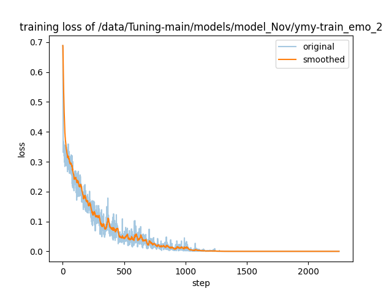

# 【赛题3】Twice_8

### Brief Guidance

[环境搭建](#chapter1)完毕后，更改/data/data_info.json文件中“test_emo”的“file_name”为测试集文件("./data/data_test.json")的绝对路径后（具体见[测试数据准备](#chapter3) ），运行predict_result.sh，最后运行combine.py 文件即可。

### <a id="chapter1"></a>环境搭建

```python
cd Twice_8_task3
pip install -r requirements.txt
```


### <a id="chapter2"></a>数据处理

data文件夹内含"annotation_train.json"、"annotation_validation.json"、"annotation_test.json"这三个原始数据文件以及"data_train.json"、"data_val.json"、"data_test.json"这三个处理后的文件。

对于原始数据文件中的每一个句子，按照【任务简介】+【历史对话】+【输出提示】的格式生成对应的模型输入。例如，原始train数据集的第一个句子处理后如下：

> 现在，你是一名情感和情绪分析专家。下面这段标记在'### ###'间的对话涉及多个说话者。### <A：你笑什么？我在问你话呢> <B：义乌的> <A：义乌哪里的？> <B：东边的> <A：东边哪里的？> <B：离你们陈家村也就百十来里地吧> <A：你妈呢？> <B：死了> <A：你再骗人？> <A：好，你这，这个有可能是没有骗的>### 请从 <Disgust, Anger, Sad, Happy, Neutral, Surprise, Fear> 中选择 <你笑什么？我在问你话呢> 的情感标签，无需分析，直接给出结果即可。

【历史对话】中，选择的对话窗口大小为10。


### <a id="chapter3"></a>测试数据准备

修改/data/data_info.json文件，将“test_emo”的file_name改为data_test.json文件的绝对路径。

```python
  "test_emo": {
    "file_name": "the/absolute/path/of/test/data",
    "columns": {
        "prompt": "instruction",
        "query": "input",
        "response": "output",
        "history": ""
    }
  }
```


### <a id="chapter4"></a>模型微调

在baichuan2上进行微调，代码如下：

```bash
CUDA_VISIBLE_DEVICES=1,2,3,4,5,6 torchrun --nproc_per_node 6 --master_port 8923 ./src/train_bash.py \
    --stage sft \
    --model_name_or_path /data/LLMs/baichuan-inc/Baichuan2-13B-Chat \
    --do_train \
    --dataset train_emo \
    --template baichuan2 \
    --finetuning_type lora \
    --lora_target all \
    --lora_rank 64 \
    --output_dir ./models/task3 \
    --overwrite_cache \
    --per_device_train_batch_size 2 \
    --gradient_accumulation_steps 32 \
    --lr_scheduler_type cosine \
    --logging_steps 1 \
    --save_steps 100 \
    --learning_rate 1e-5 \
    --num_train_epochs 30 \
    --plot_loss \
    --fp16 >> /data/ymy-med/ymy/project/情感分析/train.log 2>&1 &
```

训练的loss图如下：



使用六张A100 40G进行训练，训练过程记录如下：

> {
>     "epoch": 29.69,
>     "train_loss": 0.04069461211848344,
>     "train_runtime": 26504.4305,
>     "train_samples_per_second": 21.959,
>     "train_steps_per_second": 0.085
> }


### <a id="chapter5"></a>模型合并

经validation数据集测验，选择step1500的 LoRA 权重并导出完整模型。

模型存储在 /models/task3


### <a id="chapter6"></a>模型预测

使用合并后的模型进行标签预测

```python
sh predict_result.sh 
```

sh文件内容如下：

```bash
CUDA_VISIBLE_DEVICES=0 python ./src/train_bash.py \
    --stage sft \
    --model_name_or_path ./models/task3 \
    --do_predict \
    --dataset test_emo \
    --template baichuan \
    --output_dir ./results/task3 \
    --per_device_eval_batch_size 1 \
    --max_samples 3000 \
    --predict_with_generate \
    --temperature 0.3 \
    --repetition_penalty 1.05 >> ./logs/predict.log 2>&1 &
```

在results/task3文件夹下生成generated_predictions.json预测结果文件


### <a id="chapter7"></a>预测结果写入原始文件

将generated_predictions.json预测文件的结果写入到原始文件当中，代码如下：

```python
python combine.py
```

最终在Twice_8_task3文件夹下生成最终提交的结果文件test_label.json。


### <a id="chapter8"></a>模型对比

前期还使用了【BERT+BiGRU】、【同一说话人任务+情感预测任务微调与预测】、【情绪任务加入说话人信息进行微调与预测】这三种方法进行预测，与最终采用的【情感预测任务微调与预测】在validation上的macro-f1对比如下表所示：

|                 方法                  |      macro-f1       |
| :-----------------------------------: | :-----------------: |
|              BERT+BiGRU               | 0.33816158067989344 |
| 同一说话人任务+情感预测任务微调与预测 | 0.34088544246678243 |
| 情绪任务加入说话人信息进行微调与预测  | 0.3719065662720316  |
|         仅情感任务微调与预测          | 0.4302978874829337  |

